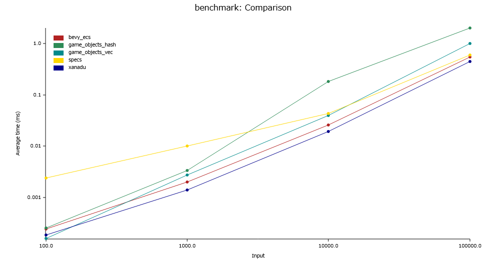

# Benchmark

```sh
cargo bench --workspace
```

## Result



| Number of entities | 10^2 (ns) | 10^3 (μs) | 10^4 (μs) | 10^5 (μs) |
| ------------------ | --------- | --------- | --------- | --------- |
| xanadu             |       184 |      1.39 |      19.4 |       452 |
| bevy_ecs           |       242 |      2.01 |      25.7 |       546 |
| specs              |      2380 |     10.03 |      43.3 |       610 |
| game_objects_vec   |       156 |      2.71 |      40.2 |      1002 |
| game_objects_hash  |       252 |      3.38 |     181.2 |      1948 |

- OS: Windows 11 Home 23H2
- CPU: Intel Core i7-12700
- RAM: Samsung DDR4 3200MHz 16GB x 2

code: [bench.rs](../benchmark/benches/bench.rs)
